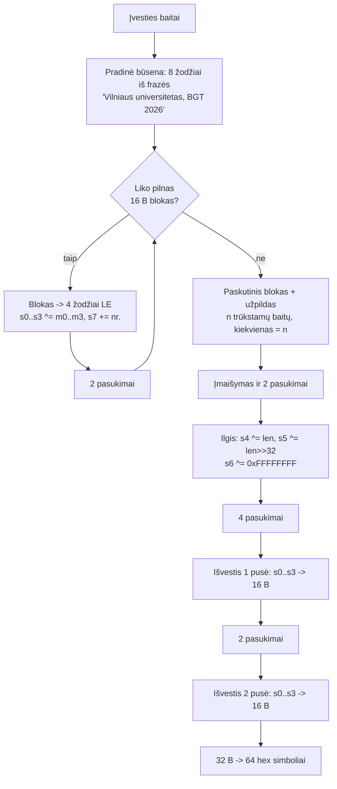
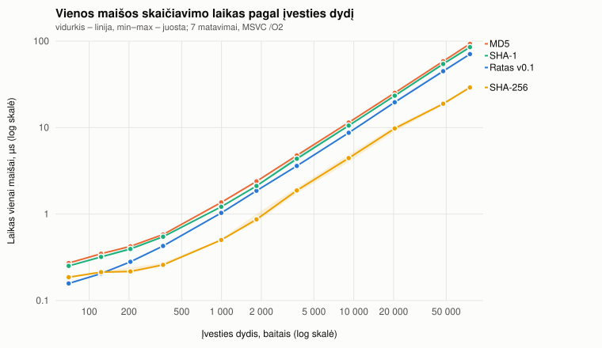
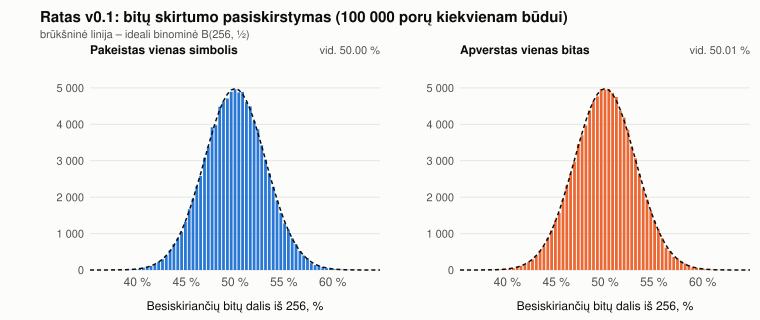

# Ratas-256 v0.1 – mokomoji 256 bitų maišos funkcija

Savos konstrukcijos maišos funkcija C++17 kalba. Iš bet kokios baitų sekos (įskaitant tuščią)
pagamina **256 bitų** santrauką – **64 mažųjų raidžių hex simbolius**. Tai viena iš dviejų
porinės užduoties realizacijų (antroji – kataloge `Rokas - AI`).

> Funkcija sukurta mokymuisi. Ji nėra kriptografiškai analizuota ir netinka slaptažodžiams,
> pinigams ar bet kokioms realioms sistemoms apsaugoti. Geri eksperimentų rezultatai žemiau
> **neįrodo** saugumo – jie tik rodo, kad paprasčiausių statistinių ydų nerasta.

Turinys: [1. Paleidimas](#1-kompiliavimas-ir-paleidimas) · [2. Idėja](#2-algoritmo-idėja) ·
[3. Pseudokodas](#3-pseudokodas) · [4. Sprendimų pagrindimas](#4-projektavimo-sprendimai-ir-jų-pagrindimas) ·
[5. Įvestis](#5-įvesties-kodavimas-ir-apribojimai) · [6. Pasukimų skaičius](#6-pasukimų-skaičiaus-parinkimas) ·
[7. Eksperimentai](#7-eksperimentai) · [8. Silpnybės ir išvados](#8-silpnybės-ko-eksperimentai-neįrodo-ir-išvados) ·
[9. Papildoma: standartai](#9-papildoma-užduotis-palyginimas-su-md5-sha-1-sha-256) · [10. Kilmė, šaltiniai, indėlis](#10-kilmė-šaltiniai-ir-indėlis)

---

## 1. Kompiliavimas ir paleidimas

Reikia C++17 kompiliatoriaus. Eksperimentų programa standartinių maišų palyginimui (tik
papildomai užduočiai) Windows'e naudoja sisteminę CNG biblioteką (`bcrypt.lib`), kitur – OpenSSL.

```bat
:: Windows, Visual Studio 2022 (iš projekto katalogo)
build.bat                   :: build\ratas.exe, build\sanity.exe, build\experiments.exe
run_all.bat                 :: viskas: kompiliavimas, patikros, eksperimentai, grafikai
```

```sh
# Linux / macOS / MSYS2 (g++ arba clang++)
sh build.sh   &&   sh run_all.sh
# arba CMake:
cmake -S . -B build -DCMAKE_BUILD_TYPE=Release && cmake --build build
```

Naudojimas (programa visada praneša, kuris režimas naudojamas, ir kiek baitų maišyta):

```text
ratas                        tekstas įvedamas ranka; Enter (naujos eilutės simbolis) NEĮTRAUKIAMAS
ratas --text "labas"         maišomi argumento baitai (UTF-8), nieko nekeičiant
ratas --file kelias.txt      maišomas failo TURINYS (ne pavadinimas), tikslūs baitai
ratas --stdin                maišomi visi standartinės įvesties baitai (dvejetainis režimas)
parinktis:  --quiet (spausdinti tik hex)
išėjimo kodai: 0 – gerai, 1 – blogi argumentai, 2 – failo nepavyko perskaityti (be santraukos!)
```

```text
$ ratas --text "lietuva"
Rezimas: text  | versija: v0.1  | ivesties baitu: 7
a9027c9d8da8b990f1c501d9db72196415576ceafe2e883172246ecfc0916836
$ ratas --text "Lietuva"   -> b2c7b3afeb8d915020deb8d484556080647f6c041446a7699978d3f29e6d94f3
$ ratas --text "Lietuva!"  -> a8b54418cf1e1331673424804954dbe2cd24b2cc46c369aef9d10a40edcc129b
$ ratas --text ""          -> 25bf155273a700862f8583fec8712c06367d2fd6eb4234279b59c593300d98d2
$ ratas --text "a"         -> d657166d0fbb82fe1df26bd98166263bb885a8dbc24b53c7dc5a3106af54587f
```

Patikros: `build\sanity` (16 API patikrų), `sh tests/cli_checks.sh` (15 komandinės eilutės patikrų).

Katalogai: `include/`, `src/` – funkcija, CLI, eksperimentai; `tests/` – patikros; `data/` –
`konstitucija.txt` ir sugeneruotos testinės įvestys (`data/exp1/`); `results/` – visų eksperimentų
lentelės (`.md`), pradiniai matavimai (`.csv`) ir grafikai (`.svg`); `tools/plot.py` – grafikų braižymas.

## 2. Algoritmo idėja

Būsena – **ratas iš 8 stipinų**: 8 × 32 bitų žodžiai = 256 bitų. Įvestis "įmaišoma" po 16 baitų,
o po kiekvieno bloko ratas **pasukamas** (viena round funkcija = vienas pasukimas). Pabaigoje
įmaišomas įvesties ilgis, ratas pasukamas dar kelis kartus, ir rezultatas nuskaitomas **dviem
pusėmis po 128 bitų** su pasukimais tarp jų – todėl santrauka niekada nėra visa vidinė būsena
vienu metu.



**Vienas pasukimas** (round). Kiekvienam stipinui *i* = 0..7 iš eilės:

```text
b = s[i+1]   c = s[i+3]   d = s[i+6]          (indeksai mod 8)
a = s[i] + (b XOR c)                            sudėtis mod 2^32
a = rotl(a, d mod 32)                           posūkis, kurio dydį lemia duomenys (stipinas d)
a = a XOR (d + RC[r])                           pasukimo konstanta RC[r]
s[i] = a
s[i+1] = s[i+1] + rotl(a, 9)                    naujas stipinas iškart stumia kitą
```

Pasukimo konstanta `RC[r] = IV[r mod 8] * (2r + 1) + r`, kur `IV` – pradinės būsenos žodžiai, o
`r` – pasukimo eilės numeris per visą skaičiavimą (0, 1, 2, …), tad nė vienas pasukimas nėra
tiksli kito kopija.

## 3. Pseudokodas

```text
RATAS256(bytes[0..n-1]):
    s[0..7] = 8 little-endian 32 bitų žodžiai iš 32 baitų frazės "Vilniaus universitetas, BGT 2026"
    r = 0                                   # pasukimų skaitiklis
    nr = 1                                  # bloko numeris
    kiekvienam pilnam 16 baitų blokui B:
        ĮMAIŠYK(B, nr); nr += 1
    likutis = paskutiniai n mod 16 baitų (gali būti 0)
    pad = 16 - ilgis(likutis)               # 1..16
    ĮMAIŠYK(likutis || pad kartų baitas pad, nr)    # užpildas dedamas VISADA (kaip PKCS#7)
    s[4] ^= n mod 2^32;  s[5] ^= n >> 32;  s[6] ^= 0xFFFFFFFF
    kartok 4 kartus: PASUK()
    out[0..15]  = s[0..3] little-endian
    kartok 2 kartus: PASUK()
    out[16..31] = s[0..3] little-endian
    grąžink out kaip 64 mažąsias hex raides

ĮMAIŠYK(B, nr):
    m[0..3] = 4 little-endian žodžiai iš B
    s[0] ^= m[0]; s[1] ^= m[1]; s[2] ^= m[2]; s[3] ^= m[3]
    s[7] += nr
    kartok 2 kartus: PASUK()

PASUK():
    rc = IV[r mod 8] * (2r + 1) + r
    i = 0..7:  a = s[i] + (s[i+1] ^ s[i+3]);  a = rotl(a, s[i+6] mod 32);  a ^= s[i+6] + rc
               s[i] = a;  s[i+1] += rotl(a, 9)
    r += 1
```

## 4. Projektavimo sprendimai ir jų pagrindimas

| Sprendimas | Kodėl |
|---|---|
| 8 × 32 bitų žodžiai (256 bitų) | 32 bitų aritmetika paprasta ir vienoda visose platformose; 256 bitų – užduotyje rekomenduotas ilgis. |
| Kiekvienas stipinas priklauso nuo trijų kitų (i+1, i+3, i+6) ir iškart stumia i+1 | Poslinkiai 1, 3, 6 nesutampa su rato simetrijomis (nedalija 8), todėl per vieną pasukimą pokytis apeina visą ratą (išmatuota – žr. 7.6). |
| Nuo duomenų priklausantis posūkis `rotl(a, d mod 32)` | Pagrindinis netiesiškumo šaltinis šalia sudėties: skirtingos būsenos suka skirtingais dydžiais, todėl skirtumų sklidimo negalima nuspėti tiesiniais metodais. |
| Pridėjimas mod 2^32 + XOR + rotate | Tik pigios operacijos (ARX tipo), nėra S-box lentelių ir daugybos; paprasta paaiškinti ir greita. |
| Pradinė būsena iš frazės, o ne "magiškų" skaičių | Konstantos akivaizdžiai savos ir patikrinamos; jos viešos, todėl jų "atsitiktinumas" saugumui nesvarbus. |
| Bloko numeris `s[7] += nr` | Tas pats blokas skirtingose vietose maišosi skirtingai (papildomai prie to, kad būsena jau ir taip skiriasi). |
| Užpildas kaip PKCS#7 + ilgis pabaigoje | Užpildas vienareikšmis: `"ab"` -> `ab 0E×14`, `"ab\0"` -> `ab 00 0D×13`. Papildomai įmaišomas tikslus ilgis (64 bitų), todėl skirtingo ilgio įvestys niekada neturi vienodos vidinės sekos. |
| Rezultatas dviem pusėmis su pasukimais tarp jų | 256 bitų būsena + 256 bitų išvestis reikštų, kad santrauka atskleidžia VISĄ galutinę būseną, o kadangi pasukimas apverčiamas, trumpą žinutę būtų galima skaičiuoti atgal. Dabar iš santraukos matoma tik pusė būsenos dviem laiko momentais; kitą pusę (128 bitų) reiktų spėti. |
| Pasukimo konstanta kinta su `r` | Kad tušti / vienodi blokai nesukurtų pasikartojančių būsenų ar simetrijų. |

## 5. Įvesties kodavimas ir apribojimai

* **Rankinis įvedimas** – viena eilutė iki Enter; naujos eilutės simbolis (`\n` arba `\r\n`)
  **neįtraukiamas**. Windows konsolėje eilutė skaitoma kaip UTF-16 ir verčiama į UTF-8, kad
  `ą`, `č` ir kt. duotų tuos pačius baitus kaip UTF-8 failas su tuo pačiu tekstu (patikrinta
  `cli_checks.sh`: `--text "ąčęėįšųūž Žąsis"` == `--file utf8_lt.txt`).
* **`--text`** – argumento baitai tokie, kokie yra (Windows'e argumentai paimami per `wmain`
  ir verčiami į UTF-8). Tarpai nešalinami, registras nekeičiamas, tekstas nenormalizuojamas.
* **`--file` / `--stdin`** – tikslūs baitai dvejetainiu režimu; eilučių pabaigos nekeičiamos
  (`tekstas`, `tekstas\n`, `tekstas\r\n` – trys skirtingos santraukos). Neperskaitomas failas –
  klaida ir kodas 2, o ne tuščios įvesties santrauka.
* **Ilgis**: algoritmas apdoroja įvestį blokais ir ilgį laiko 64 bitų skaičiuje, tad teoriškai
  tinka bet kokiam ilgiui. Praktinį apribojimą lemia tai, kad programa **visą failą įkelia į
  atmintį** (`std::vector`), t. y. riba – laisva RAM. Srautinis skaitymas neįgyvendintas.
* **Simboliai vs baitai**: maišomi baitai. `ąčęėįšųūž Žąsis` – 15 simbolių, bet 26 baitai (žr. `results/exp1_inputs.md`).

## 6. Pasukimų skaičiaus parinkimas

Pasukimų skaičiai (2 po bloko, 4 pabaigoje, 2 tarp išvesties pusių) parinkti ne "iš akies", o
pagal difuzijos matavimą (`results/exp_diffusion.md`, žr. 7.6): atsitiktinei būsenai įvedus vieno
bito skirtumą bloko įvedimo vietoje, po **vieno** pasukimo skiriasi vidutiniškai tik **37,8 %**
būsenos bitų (blogiausiu atveju 33 iš 256), o po **dviejų** – jau 50,0 % (min 98). Todėl po kiekvieno
bloko sukama 2 kartus – kiekvienas blokas pilnai išsimaišo dar prieš ateinant kitam, o pabaigoje
(4 + 2 pasukimai) lieka dviguba atsarga. Kaina – sparta: su 1 pasukimu funkcija būtų ~1,8 karto
greitesnė, bet paskutinio bloko pokytį iki išvesties skirtų tik 3 pasukimai.

Svarbu: santraukų statistika (lavina, kolizijos) tokio skirtumo neparodytų – ji ir su vienu
pasukimu atrodo "ideali". Tik vidinės būsenos matavimas atskleidžia, kad atsarga per maža.

## 7. Eksperimentai

**Aplinka.** AMD Ryzen 9 7900X (12 branduolių, iki 4,7 GHz), 32 GB RAM, Windows 11 Pro 10.0.26200,
MSVC 19.44 (Visual Studio 2022), `cl /std:c++17 /O2 /EHsc /W4 /utf-8`, viena gija.
**Atkartojamumas.** Visos atsitiktinės įvestys – iš savo `xorshift64*` generatoriaus su seed
`20260920` (+ ilgis, kur nurodyta), abėcėlė – spausdinami ASCII simboliai `!`..`~` (94 simboliai,
1 simbolis = 1 baitas). Viską iš naujo sugeneruoja `build\experiments all`; pradiniai duomenys ir
lentelės – `results/`. Visi skaičiai žemiau nukopijuoti iš tų failų.

### 7.1. Testinės įvestys (1 eksp.) – `results/exp1_inputs.md`

34 failai `data/exp1/`: tuščias; `a`, `b` (1 baitas, be `\n`); trys atsitiktiniai ASCII failai
(1500, 2048, 4096 B) ir kiekvieno kopijos su **tiksliai vienu** pakeistu baitu pradžioje, viduryje,
pabaigoje; pasikartojantys simboliai, sukeista tvarka (`abc`/`cba`, `labas rytas`/`rytas labas`),
tarpai pradžioje/pabaigoje, `tekstas` be / su `\n` / su `\r\n`, bloko ribos 15/16/17 B, užpildo
atvejai `ab` / `ab\0`, UTF-8 (`ąčęėįšųūž Žąsis` – 15 simbolių / 26 baitai; `Vilnius – Lietuva €` – 19 / 23).

### 7.2. Išvesties formatas (2 eksp.) – `results/exp2_format.md`, `results/exp3_cli.md`

Visų 34 failų santraukos – 64 simboliai iš `[0-9a-f]`, netinkamo formato – 0.
Pradinių nulių pavyzdys: `nulis14` -> `0a52ab49…` (64 simboliai). Vienodo turinio failai skirtingais
vardais (`struct_space_none.txt` = `struct_space_none_copy.txt`) – vienintelė sutampanti pora, kaip ir
turi būti. Komandinės eilutės patikros (15/15): `--text` == `--file` == rankinis == `--stdin`, kai
baitai sutampa (`a`, `b`, `tekstas`, tuščia įvestis, UTF-8); `tekstas\n` skiriasi; neskaitomas failas
-> klaida (kodas 2, be santraukos).

### 7.3. Determinizmas (3 eksp.) – `results/exp3_determinism.md`, `results/exp3_cli.md`

Kiekviena įvestis maišyta 3 kartus iš eilės, seka **A, B, A**, ir A po 4096 B failo – visi
rezultatai sutapo (neatitikimų 0). Atskirais programos paleidimais (34 failai × 2 paleidimai, tarp
jų kita įvestis) – visi sutapo. Funkcijoje nėra laiko, atsitiktinumo ar globalios būsenos.

### 7.4. Sparta (4 eksp.) – `results/exp4_bench.md`, `.csv`, `results/exp4_speed.svg`

`data/konstitucija.txt` (75 595 B, 789 eilučių, UTF-8, LF; šaltinis – kurso nuoroda `bit.ly/33nYy2v`).
Ištraukos iš 1, 2, 4, …, 512 eilučių ir visas failas, sudaromos **prieš** matavimą; matuojamas tik
`hash()` kvietimas (`std::chrono::steady_clock`), 3 apšilimo kvietimai, 7 matavimai, kiekvienas –
grupė iš N kvietimų (~20 ms), laikas / N; rezultatas naudojamas per `volatile`.

| Eilučių | Baitų | Ratas v0.1 vid. µs (min–max) | MB/s | SHA-256 vid. µs | SHA-1 vid. µs | MD5 vid. µs |
|---:|---:|---|---:|---:|---:|---:|
| 1 | 70 | 0,158 (0,156–0,162) | 444 | 0,186 | 0,251 | 0,271 |
| 8 | 362 | 0,427 (0,426–0,430) | 847 | 0,258 | 0,547 | 0,581 |
| 64 | 3 712 | 3,61 (3,60–3,62) | 1 030 | 1,88 | 4,36 | 4,76 |
| 512 | 47 434 | 44,9 (44,5–46,8) | 1 056 | 18,9 | 54,4 | 58,5 |
| 789 (visas) | 75 595 | 70,9 (70,8–71,0) | 1 067 | 29,1 | 85,3 | 93,2 |



Tendencija: laikas **tiesiškai** proporcingas baitų skaičiui (log-log grafike – tiesė nuolydžiu ~1);
nuo ~1 KB sparta nusistovi ties ~1 050 MB/s. Mažoms įvestims (< 200 B) dominuoja pastovi pabaigos
kaina (6 pasukimai + užpildo blokas), todėl MB/s ten mažesnis. Anomalijų nepastebėta; sklaida
(min–max) < 5 % (didžiausia 512 eilučių taške: 44,5–46,8 µs – tikėtina, OS trukdis).

### 7.5. Kolizijos (5 eksp.) – `results/exp5_collisions.md`

Kiekvienam ilgiui 10, 100, 500, 1000 – po **100 000 porų** (200 000 eilučių), poros narės garantuotai
skiriasi; seed = 20260920 + ilgis.

| Ilgis | Porų | Kolizijų porose | Skirtingų įvesčių | Grupių su bendra santrauka |
|---:|---:|:---:|---:|:---:|
| 10 | 100 000 | 0 | 200 000 | 0 |
| 100 | 100 000 | 0 | 200 000 | 0 |
| 500 | 100 000 | 0 | 200 000 | 0 |
| 1 000 | 100 000 | 0 | 200 000 | 0 |

Struktūruotos įvestys (50 039 skirtingos): visi `abcdefgh` perstatymai, `a`×k, `ab`×k, `abc`×k,
visos 2 simbolių eilutės, visi 256 vieno baito atvejai, `ab` + užpildo reikšmę imituojantys baitai,
`\0`×k – kolizijų **0**.

Kodėl tai įprasta ir nieko neįrodo: 200 000 įvesčių sudaro ~2·10^10 porų; idealiai 256 bitų maišai
vienos poros kolizijos tikimybė ~2^-256, tad tikėtinas kolizijų skaičius ~2·10^10 / 2^256 ≈ 10^-67.
Kolizijų nerasti šiuo būdu galima ir labai blogai funkcijai (pvz., tokiai, kurios išvestis priklauso
tik nuo pirmų 8 baitų – atsitiktiniai 10+ baitų bandymai jos neišduotų). Todėl pridėti struktūruoti
rinkiniai – jie tikrina būtent tokias "aklas zonas": perstatymus, pasikartojimus, užpildo ribas.

### 7.6. Lavinos efektas (6 eksp.) – `results/exp6_avalanche.md`, `exp6_hist.csv`, `exp6_histogram.svg`

100 000 porų (po 25 000 kiekvienam ilgiui), kiekvienoje pakeistas **vienas** atsitiktinai parinktas
simbolis kitu abėcėlės simboliu (ilgis nekinta). Bitų skirtumas skaičiuojamas iš **dekoduotų baitų**
(XOR ir bitų skaičiavimas), hex skirtumas – pagal 4 bitų grupes.

| Ilgis | Porų | Bitų skirt. min / **vid.** / max % | Hex skirt. min / **vid.** / max % |
|---:|---:|---|---|
| 10 | 25 000 | 37,89 / **50,03** / 62,50 | 78,12 / **93,76** / 100 |
| 100 | 25 000 | 37,50 / **49,99** / 62,89 | 79,69 / **93,73** / 100 |
| 500 | 25 000 | 38,67 / **50,01** / 62,11 | 78,12 / **93,79** / 100 |
| 1000 | 25 000 | 37,89 / **49,98** / 63,28 | 79,69 / **93,75** / 100 |
| **visi** | **100 000** | 37,50 / **50,00** / 63,28 | 78,12 / **93,76** / 100 |

Papildomai apverstas **tiksliai vienas įvesties bitas** (baitų režimu, nedekoduojant UTF-8):
vid. 50,01 % bitų (min 36,72, max 64,45) / 93,77 % hex. Orientacinės idealios reikšmės – 50 % ir 93,75 %.



Abi histogramos (simbolio pakeitimas ir vieno bito apvertimas) sutampa su idealia binomine kreive
B(256, ½) (vid. 128 bitų, σ ≈ 8): 2/3 porų skiriasi 46,9–53,1 % bitų, kraštutiniai atvejai (36–64 %)
reti, kaip ir turi būti. Tarp ilgių skirtumų nėra.

**Difuzija per pasukimą** (papildomas matavimas, `results/exp_diffusion.md`): atsitiktinė būsena,
vienas bitas pakeistas bloko įvedimo vietoje, pasukama t kartų:

| t | skirt. bitų min / vid. / max | vid. % |
|---:|---|---:|
| 1 | 33 / 96,9 / 142 | 37,8 |
| 2 | 98 / 128,0 / 154 | 50,0 |
| 3 | 100 / 128,0 / 157 | 50,0 |

Būtent šis matavimas lėmė 2 pasukimus po bloko (žr. 6 sk.).

**Ar funkcija gali rodyti gerą lavinos efektą ir vis tiek leisti lengvai rasti kolizijas?** Taip.
Pvz., jei funkcija ignoruotų kai kuriuos įvesties baitus, atsitiktinės poros vis tiek dažniausiai
skirtųsi "matomose" vietose ir lavina atrodytų puiki, o kolizijas būtų galima rinkti rankomis.
Arba jei užpildas būtų dviprasmis (`ab` ir `ab\0` be ilgio), kolizijos gautųsi tik specifinėms
poroms, kurių atsitiktiniai testai beveik negeneruoja. Tokias silpnybes išduotų **struktūruoti**
testai (7.5: pakeistas 1 baitas kiekvienoje pozicijoje, užpildo ribos, `\0` uodegos), o ne lavinos
statistika. Lavina matuoja tik "vidutinį" elgesį, kolizijų atsparumas – blogiausią.

### 7.7. Spėjimas, vieša druska, slaptas atsitiktinumas (7 eksp.) – `results/exp7_preimage.md`

Kandidatai `0000`..`9999`, tikslas `7391` (atakai duota tik santrauka).

1. **Be druskos**: perrinkti visi 10 000 kandidatų per 1,0 ms (0,10 µs vienam); sutapimas ties
   7 392-uoju bandymu, sutampa vienintelis `7391`. Sutapimas **nebūtinai** identifikuoja pradinę
   įvestį – rasta įvestis su ta pačia santrauka, o tai teoriškai gali būti kolizija. Praktiškai su
   256 bitų maiša ir 10 000 kandidatų tai ta pati įvestis. Išvada: **kai įvesčių aibė maža, jokia
   maiša neapsaugo** – net jei išvestys atrodo atsitiktinės, kandidatus galima perrinkti.
2. **Vieša druska** (8 atsitiktiniai baitai `9e2a81f058112dc5`, pridedami po įvesties kaip baitai):
   pastangos vienam taikiniui tos pačios – 10 000 maišų per 1,1 ms. Iš anksto apskaičiuota lentelė
   su viena druska kitam taikiniui su kita druska netiko (patikrinta) – druska naikina lentelių
   pakartotinį naudojimą, bet ne perrinkimą.
3. **Slaptas r** (2 baitai, 65 536 galimybių): paieškos erdvė išauga iki 10 000 × 65 536; perrinkus
   1/64 erdvės (10,24 mln. bandymų, 1,13 s) tikslas nerastas, visa erdvė užtruktų ~72 s; su 16 baitų
   r – praktiškai neįmanoma. Atskleidus r, patikra – viena maiša. Tai įsipareigojimo (commitment)
   idėja, bet **neįrodo**, kad Ratas-256 saugiai slepia pranešimą ar neleidžia jo pakeisti.

Nuo darbo įrodymo (proof-of-work) tai skiriasi: ten ieškoma nonce, kad santrauka tenkintų sąlygą;
druskos pridėjimas neparodo tinkamumo tokiems galvosūkiams. Slaptažodžiams reikia Argon2id ir pan.

## 8. Silpnybės, ko eksperimentai neįrodo, ir išvados

**Žinomos silpnybės / apribojimai**

* Konstrukcija nerecenzuota – nėra jokių saugumo garantijų; pasukimas yra **apverčiamas**, tad visas
  atsparumas pirmavaizdžiui remiasi tuo, kad santrauka neatskleidžia 128 bitų (s4..s7) būsenos.
  Tai ~128 bitų, o ne 256 bitų, lygio prielaida; be to, ji neanalizuota.
* Bloko įmaišymas – paprastas XOR į s0..s3, o "paslėpta" dalis – tik 128 bitų. Užpuolikas, galintis
  rinktis ilgas žinutes, turi daug laisvės (tai tipinė vieta diferencialinėms atakoms, kurių čia
  neieškota).
* Nuo duomenų priklausantis posūkis kai kuriose būsenose gali būti 0 (jokio posūkio) – tai reta
  (1/32), bet tokių "silpnų" būsenų analizė neatlikta.
* Pasukimų skaičius parinktas pagal vieną difuzijos matavimą, ne pagal atakų analizę – atsarga
  (2 pasukimai vietoj 1 reikalingo pilnai difuzijai) yra nedidelė, palyginti su standartais.
* Nėra rakto ar druskos parametro; nėra srautinio skaitymo (failas įkeliamas visas).

**Ko eksperimentai negali pagrįsti.** Nerasta kolizija ≠ atsparumas kolizijoms (7.5: net idealiai
funkcijai tikimybė rasti koliziją per 10^10 porų ~10^-67, tad rezultatas neatskiria geros funkcijos
nuo vidutinės). Lavina 50 % ≠ saugumas (žr. 7.6 aptarimą: ta pati funkcija su vienu pasukimu
statistiškai atrodytų lygiai taip pat, nors difuzija būtų nepilna). Nepavykusi pirmavaizdžio ataka
su 10 000 kandidatų nieko nesako apie struktūrines atakas.

**Kas pagerėjo / pablogėjo.** Tai pirmoji versija (v0.1), todėl versijų palyginimo dar nėra.
Kandidatai kitoms versijoms: didesnė paslėpta būsenos dalis (pvz., 384 bitų būsena), papildomas
pasukimas po bloko, srautinis failų skaitymas.

**Ryšys su paskaitos sąvokomis.** Pirmavaizdis: mažoje kandidatų aibėje jį randa perrinkimas
(7.7), todėl vien "atsitiktinai atrodanti" išvestis nieko neslepia; slaptas r keičia paieškos erdvę.
Kolizijos: egzistuoja būtinai (begalė įvesčių -> 2^256 išvesčių), klausimas tik ar jas lengva rasti;
mūsų testai jų nerado, bet tai silpnas įrodymas. Lavina: geras vidutinis elgesys būtinas, bet
nepakankamas. Patikimos maišos reikšmės blokų grandinėje remiasi būtent atsparumu antrajam
pirmavaizdžiui ir kolizijoms – to mokomoji funkcija neužtikrina.

## 9. Papildoma užduotis: palyginimas su MD5, SHA-1, SHA-256

Tos pačios įvestys ir aplinka (Windows CNG realizacijos, viena gija). Procentai normalizuoti pagal
kiekvienos funkcijos ilgį (128 / 160 / 256 bitų).

| Funkcija | Ilgis, bitų | Sparta, visas failas (75 595 B) | MB/s | Lavina: bitų vid. % (min–max) | Hex vid. % |
|---|---:|---:|---:|---|---:|
| Ratas v0.1 | 256 | 70,9 µs | 1 067 | 50,00 (37,5–63,3) | 93,76 |
| SHA-256 | 256 | 29,1 µs | 2 596 | 49,98 (36,7–62,9) | 93,74 |
| SHA-1 | 160 | 85,3 µs | 886 | 50,00 (31,3–66,9) | 93,75 |
| MD5 | 128 | 93,2 µs | 811 | 49,99 (31,3–68,8) | 93,72 |

Lavinos statistika visų funkcijų vienoda (idealo ribose) – ji negali atskirti "sulaužytų" MD5 /
SHA-1 nuo SHA-256, kas dar kartą rodo, kad ji nėra saugumo matas. Platesnis MD5 / SHA-1 min–max
intervalas – tik trumpesnio ilgio pasekmė (mažiau bitų -> didesnė santykinė sklaida). Sparta: SHA-256
čia greičiausia, nes CNG naudoja procesoriaus SHA instrukcijas; Ratas v0.1 – tarp SHA-256 ir SHA-1
(~20 % greitesnė už SHA-1 ir MD5 programines realizacijas). MD5 ir SHA-1 pateikiami tik kaip
istoriniai pavyzdžiai – jų atsparumas kolizijoms pažeistas (NIST).

## 10. Kilmė, šaltiniai ir indėlis

* Konstrukcija sava: nenaudojamos jokios SHA-2 / SHA-3 / MD5 / BLAKE / SipHash / xxHash / Murmur /
  FNV ir kt. konstantos, S-box'ai, raundų funkcijos ar užbaigimo procedūros. Bendri principai
  (blokinis įmaišymas, ARX operacijos, ilgio įmaišymas, PKCS#7 stiliaus užpildas) yra viešai žinomi
  metodai, ne konkrečių algoritmų kopijos. Nuo poros nario Roko realizacijos skiriasi
  struktūriškai: 32 bitų žodžiai (ne 64), 16 B blokai (ne 32), nuo duomenų priklausantys posūkiai
  ir rato grįžtamasis ryšys (ne daugyba iš konstantų su pirmyn / atgal perėjimais), PKCS#7 užpildas
  (ne ilgio žymė), išvestis dviem pusėmis (ne 512 -> 256 sulenkimas).
* Standartinės bibliotekos naudotos tik failams, laikui, konteineriams; MD5 / SHA-1 / SHA-256 – tik
  palyginimui (Windows CNG / OpenSSL).
* Šaltiniai: užduoties aprašas (VU, Blokų grandinių technologijos, 2026); NIST Hash Functions
  (csrc.nist.gov/projects/hash-functions); RFC 9106 (Argon2); `konstitucija.txt` – kurso nuoroda.
* **Indėlis poroje:** ši realizacija, jos eksperimentai ir šis README – Joringis; antroji
  realizacija (katalogas `Rokas - AI`) – poros nario Roko. Bendras abiejų realizacijų palyginimas
  su tuo pačiu duomenų rinkiniu ir aplinka – bendrame repozitorijos README (kitas etapas).
