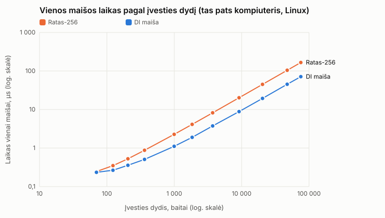

# BGT 1 užduotis: dvi 256 bitų maišos funkcijos · V0.12

Porinis darbas: dvi atskiros realizacijos – Ratas-256 ir DI maiša – palygintos tomis pačiomis sąlygomis.

> Abi funkcijos kriptografiškai neanalizuotos – netinka slaptažodžiams ir saugumui.

## 1. Kas ką padarė

| | Ratas-256 | DI maiša |
|---|---|---|
| Katalogas | [`Joringis-no AI/`](Joringis-no%20AI/README.md) | [`Rokas - AI/`](Rokas%20-%20AI/README.md) |
| Kalba | C++17, vienas failas `ratas.cpp` | C++20, CMake |
| Indėlis į bendrą dalį | duomenų rinkinys: `data/exp1`, `konstitucija.txt` | eksperimentų programa: `experiments.cpp`, `report.py` |

Paleidimas, pseudokodas ir sprendimų pagrindimas – kiekvieno kataloge README.

## 2. Du algoritmai

| | Ratas-256 v0.12 | DI maiša V0.12 |
|---|---|---|
| Būsena | 8 × 32 b = 256 b | 8 × 64 b = 512 b |
| Blokas | 16 B, 2 pasukimai, feed-forward, 64 b bloko numeris | 32 B, perėjimas pirmyn ir atgal |
| Netiesiškumas | nuo duomenų priklausantis posūkis (1..31 bitų) | daugyba iš nelyginių konstantų |
| Pabaiga | PKCS#7, ilgis, 4 pasukimai | likučio ilgis žymėje, ilgis, 3 tušti žingsniai |
| Išvestis | dvi būsenos pusės, tarp jų – 2 pasukimai | 512 → 256 sulenkimas |

## 3. Vienodos sąlygos

* **Ta pati eksperimentų programa** – skiriasi tik adapteris `experiments/impl_*.cpp`.
* **Tie patys duomenys:** `exp1` (34 failai, turinys tikrinamas `check_fixtures.py`), `konstitucija.txt`, seed 20260920, abėcėlė `!`..`~`.
* **Atkartojamumas:** 1–3, 5 ir 6 eksperimentų rezultatai paleidus iš naujo sutampa **baitas į baitą** (Ratas-256 – net Windows / MSVC ir Linux / g++).
* **Sparta:** abi realizacijos matuojamos tame pačiame kompiuteryje – atskirai Windows ir Linux (`palyginimas/`).

## 4. Teisingumas (1–3)

| Patikra | Ratas-256 v0.12 | DI maiša V0.12 |
|---|---|---|
| 21 įvesčių pora: 1 B pakeitimai, tvarka, tarpai, LF / CRLF, `\0` | 21/21 | 21/21 |
| 64 hex, mažosios raidės, pradiniai nuliai | 34/34 | 34/34 |
| A, B, A ir kartotiniai kvietimai | ✓ | ✓ |
| atskiri paleidimai / ranka = failas | 34/34, 31/31 | 34/34, 31/31 |

## 5. Sparta (4)

Abi realizacijos tame pačiame kompiuteryje; 3 apšilimai + 10 matavimų, be I/O. Vidurkis, µs:

| Kompiuteris | Versijos: Ratas-256 / DI | 70 B: Ratas-256 / DI | 75 595 B: Ratas-256 / DI | DI greitesnė |
|---|---|---|---|---|
| i9-10900K, Linux, g++ 15.2 `-O3` | v0.12 / V0.12 | 0,177 / 0,101 | 77,12 / 34,41 | 1,8× / 2,2× |
| Ryzen 9 7900X, Windows 11, MSVC `/O2` (grafikas) | v0.1 / V0.1 | 0,155 / 0,112 | 74,08 / 32,27 | 1,4× / 2,3× |

Abiejų laikas auga tiesiškai. Ratas-256 v0.12 feed-forward kainavo ≈ 9 % spartos (Linux, lyginant su v0.1). → [visos lentelės](palyginimas/sparta.md)

## 6. Kolizijos (5)

| | Tikėtina | Ratas-256 v0.12 | DI maiša V0.12 |
|---|---|---|---|
| 4 × 100 000 porų ir 4 × 200 000 įvesčių | ≈ 10^(−67) | 0 | 0 |
| 119 374 struktūruotos įvestys | ≈ 0 | 0 | 0 |
| maiša sutrumpinta iki 24 bitų | 4 768 | 4 776 | 4 654 |
| maiša sutrumpinta iki 32 bitų | 18,6 | 25 | 19 |

* Nulis 256 bitų maišai – įprastas ir **nieko neįrodo**.
* Sutrumpintos maišos atitinka gimtadienio paradoksą – abi elgiasi kaip atsitiktinės.

## 7. Lavinos efektas (6)

| 100 000 porų | Idealu | Ratas-256 v0.12 | DI maiša V0.12 |
|---|---|---|---|
| bitų skirtumas | 50 % | 49,99 % | 50,00 % |
| min–max | – | 36,3–64,1 % | 36,7–64,5 % |
| standartinis nuokrypis | 3,13 % | 3,13 % | 3,12 % |
| hex skirtumas | 93,75 % | 93,74 % | 93,75 % |
| apverstas 1 įvesties bitas | 50 % | 50,00 % | 50,01 % |

Histogramos: [Ratas-256](Joringis-no%20AI/results/exp6_lavina.md) · [DI maiša](Rokas%20-%20AI/results/exp6_lavina.md)

## 8. Spėjimas ir druska (7)

Abiejų rezultatai sutampa:

| Atvejis | Maišų | Rezultatas |
|---|---|---|
| `0000`–`9999` be druskos | 3 984, ≈ 1 ms | vienintelis sutapimas `3983` |
| viena lentelė 5 taikiniams | 10 000 | 5/5 |
| vieša druska, atskira kiekvienam | 5 × 10 000 | 5/5 |
| slaptas 16 B `r` | 10 000 · 2^128 | neperrenkama |

## 9. Išvados (8)

* **Statistiškai nesiskiria:** abi praeina 1–3, 0 kolizijų, lavinos efektas ≈ idealus.
* **Sparta:** DI maiša ilgiems failams ≈ 2,2–2,3 karto greitesnė; mažoms įvestims – ≈ 1,4–1,8 karto.
* **Testai neįrodo** saugumo, atsparumo kolizijoms ar pirmavaizdžiui; geras lavinos efektas galimas ir silpnai funkcijai.
* **Pirmavaizdis:** mažą aibę abi perrenka per ≈ 1 ms – sunkumą lemia paieškos erdvė, ne maiša.

## 10. Silpnybės

| Ratas-256 v0.12 | DI maiša V0.12 |
|---|---|
| būsena lygi išvesties dydžiui (256 b) | vienas maišymo žingsnis 32 B blokui |
| pabaiga be feed-forward – ją galima atsukti (jo README, v0.2 skyrius) | tiesinis 512 → 256 sulenkimas |

Abiem: nerecenzuota, nėra rakto ir druskos. Ratas-256 failą įkelia į atmintį; DI maiša (nuo V0.12) skaito dalimis.

## 11. DI naudojimas

DI naudota **DI maišai**, bendrai eksperimentų programai, bendram README ir spartos palyginimui: Claude Code (Anthropic), Claude Opus modeliai.
Užklausos, priimti ir atmesti pasiūlymai, patikra – [DI maišos README, 18 skyrius](Rokas%20-%20AI/README.md#18-di-naudojimas).

## 12. Versija

* `V0.1` – Ratas-256 ir DI maiša, palygintos šiame README.
* `V0.11` – DI maiša: pataisytas bendras CRLF testinis failas, nauji testai, maišos reikšmės nepakito.
  Ratas-256 v0.11: posūkis 0 → 1, ne ASCII failų vardai (Windows).
* `V0.12` – abi realizacijos V0.12:
  * DI maiša: failai skaitomi dalimis, iki 3 % greitesnė, nauji testai; maišos reikšmės nepakito.
  * Ratas-256 v0.12: feed-forward po kiekvieno bloko, 64 b bloko numeris
    (commit'ai `6b0dd58` ir `9b3a3ca` perkelti į šią šaką).
  * Spartos palyginimas pakartotas Linux su šiomis versijomis (Windows matavimai – V0.1 kodas).
