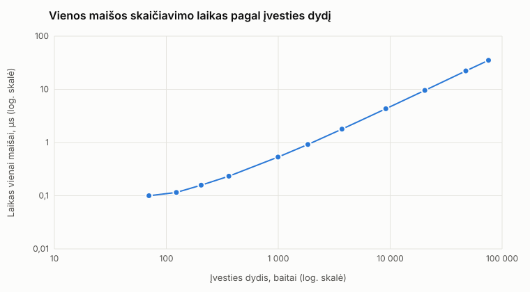
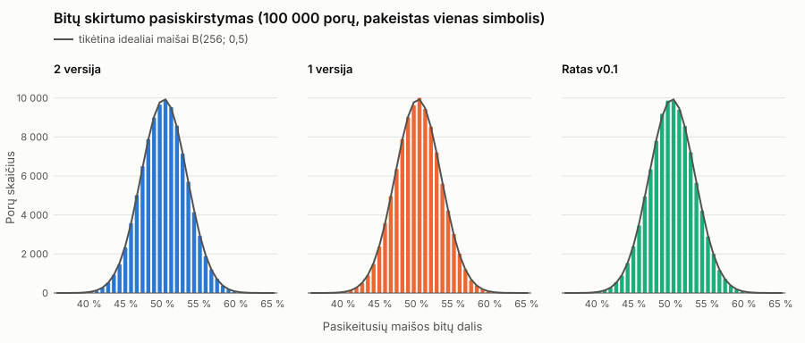

# DI maišos funkcija

256 bitų maišos funkcija, C++20. Iš bet kokių baitų – 64 hex simboliai.

> Kriptografiškai neanalizuota – netinka slaptažodžiams ir saugumui.

## 1. Paleidimas

```bash
cmake -S . -B build -DCMAKE_BUILD_TYPE=Release && cmake --build build

./build/hash-generator                  # tekstas ranka, Enter baigia
./build/hash-generator --text "hello"   # 2607ba4e…43936c54
./build/hash-generator --file failas.txt

./build/sanity-checks                   # 54 patikros
./tests/run_sanity.sh build             # 27 patikros
./experiments/run_all.sh                # visi eksperimentai → results/
```

## 2. Algoritmas vienu žvilgsniu

```text
Įvestis → 32 baitų blokai → 4 × 64 bitų žodžiai
   ↓
512 bitų būsena  s0 s1 s2 s3 s4 s5 s6 s7
   ↓  maišymas pirmyn → maišymas atgal     (kiekvienam blokui)
   ↓  likutis → ilgis → 3 tušti žingsniai
512 → 256 bitų sulenkimas → 64 hex
```

## 3. Blokas ir būsena

```text
baitai  0–7  → word0        baitai 16–23 → word2
baitai  8–15 → word1        baitai 24–31 → word3
```

* 8 × `uint64_t` = **512 bitų** būsena, pradžia – fiksuotos konstantos.
* Būsena tarp blokų **nenunulinama**; kiekvienas blokas turi pozicijos žymę.

## 4. Žodžių įterpimas

```cpp
s[0] += word0 ^ tag;
s[2] ^= word1;
s[4] += word2;
s[6] ^= word3;
```

## 5. Maišymas pirmyn ir atgal

```cpp
s[i] = (s[i] ^ std::rotl(s[i - 1], 41)) * kMulForward;   // i = 1 … 7
s[i] = (s[i] + std::rotl(s[i + 1], 53)) * kMulBackward;  // i = 6 … 0
```

```text
pirmyn:  s0 → s1 → s2 → s3 → s4 → s5 → s6 → s7
atgal:   s0 ← s1 ← s2 ← s3 ← s4 ← s5 ← s6 ← s7
```

Po vieno bloko **visos 8 dalys priklauso nuo visų 4 žodžių**.

## 6. Pabaiga ir 256 bitų rezultatas

* **Likutis** (0–31 B) → nuliais užpildytas blokas, jo ilgis įmaišomas į žymę (`ab` ≠ `ab\0`).
* **Ilgis** – atskiras žingsnis; tada **3 tušti** maišymo žingsniai.

```text
out0 = s0 XOR rotl(s4, 40)      out2 = s2 XOR rotl(s6, 40)
out1 = s1 XOR rotl(s5, 40)      out3 = s3 XOR rotl(s7, 40)
```

## 7. Pseudokodas

```text
STEP(w0..w3, tag):
    s0 += w0 XOR tag;  s2 ^= w1;  s4 += w2;  s6 ^= w3
    for i = 1..7:        s[i] = (s[i] XOR rotl(s[i-1], 41)) * MUL_F
    for i = 6 down to 0: s[i] = (s[i]  +  rotl(s[i+1], 53)) * MUL_B

HASH(input):
    s = LANE_INIT;  L = ilgis;  n = L / 32;  r = L mod 32
    for i = 0..n-1:  STEP(blokas i, (i+1) * TAG_STEP)
    STEP(likutis + nuliai, (n+1) * TAG_STEP + (r+1) * TAG_TAIL)
    STEP(L, rotl(L, 32), 0, 0, TAG_END)
    for j = 1..3:    STEP(0, 0, 0, 0, TAG_END + j * TAG_STEP)
    return s[i] XOR rotl(s[i+4], 40), i = 0..3      # 32 B, didysis galas
```

## 8. Kodėl taip

* **Du perėjimai** – pokytis pasiekia visą būseną per vieną žingsnį.
* **Nelyginė daugyba** – netiesiška ir apverčiama, informacija neprarandama.
* **Žymės** vietoj `0x80` baito – pozicija ir ilgis įmaišomi skaičiais.
* **512 → 256** – maiša neatskleidžia visos būsenos, todėl jos negalima tiesiog „atsukti“ atgal.

## 9. Įvestis

| Režimas | Kas maišoma |
|---|---|
| ranka | viena eilutė; **Enter neįtraukiamas**, tarpai ir `\r` lieka |
| `--text` | argumento baitai (UTF-8), nieko nekeičiant |
| `--file` | tikslūs failo baitai; neperskaitomas failas – klaida |

* Režimas parašomas `stderr`, maiša – `stdout`; rezultatas visada 64 mažosios hex raidės.
* Riba: failas įkeliamas į RAM; ilgis – `uint64_t`.

## 10. Eksperimentų sąlygos

| | |
|---|---|
| Aplinka | i9-10900K, Linux 6.18, g++ 15.2, `-O3`, 1 gija ([aplinka.md](results/aplinka.md)) |
| Duomenys | bendras poros rinkinys: `exp1` failai, `konstitucija.txt` |
| Atsitiktinės įvestys | `std::mt19937_64`, seed 20260920, abėcėlė `!`..`~` (94 simboliai) |
| Atkūrimas | `./experiments/run_all.sh`, neapdoroti duomenys – `results/raw/` |

## 11. Teisingumas (1–3)

| Patikra | Rezultatas |
|---|---|
| 1 baito pakeitimai, tvarka, tarpai, LF / CRLF, `\0`, 15/16/17 B | 22/22 ✓ |
| 64 hex, mažosios raidės, pradiniai nuliai | 35/35 ✓ |
| kartotiniai kvietimai, A, B, A | ✓ |
| atskiri paleidimai / ranka = failas / `--text` = failas | 34/34, 31/31, 31/31 ✓ |

UTF-8: `utf8_lt.txt` – 15 simbolių, 26 baitai. → [exp1_3_teisingumas.md](results/exp1_3_teisingumas.md)

## 12. Sparta (4)



| Baitai | µs vienai maišai | min–max |
|---|---|---|
| 70 | 0,100 | 0,098–0,101 |
| 996 | 0,532 | 0,529–0,533 |
| 20 409 | 9,571 | 9,491–9,584 |
| 75 595 | 35,191 | 34,864–35,362 |

* Laikas auga **tiesiškai**, ≈ **2,1 GB/s**; mažoms įvestims – pastovios 5 žingsnių išlaidos.
* 3 apšilimai + 10 matavimų, be I/O. → [exp4_sparta.md](results/exp4_sparta.md)

## 13. Kolizijos (5)

| Tikrinimas | Kolizijų |
|---|---|
| 4 × 100 000 porų (ilgiai 10, 100, 500, 1 000) | 0 |
| 4 × 200 000 įvesčių, visas rinkinys | 0 |
| 119 374 struktūruotos įvestys | 0 |
| tas pats, maiša sutrumpinta iki 32 bitų | 19 (tikėtina 18,6) |

* 256 bitams tikėtina ≈ 10^(−67) kolizijų – **nulis nieko neįrodo**.
* Sutrumpinta maiša rodo, kad testas kolizijas randa. → [exp5_kolizijos.md](results/exp5_kolizijos.md)

## 14. Lavinos efektas (6)



| Ilgis | Bitai, % | Hex, % |
|---|---|---|
| 10 | 49,99 | 93,75 |
| 100 | 50,00 | 93,74 |
| 500 | 50,03 | 93,75 |
| 1 000 | 49,97 | 93,74 |
| **visi** | **50,00** (36,7–64,5) | **93,75** (76,6–100) |

* Pasiskirstymas sutampa su idealiu B(256; 0,5). → [exp6_lavina.md](results/exp6_lavina.md)
* Geras lavinos efektas **neatmeta** lengvų kolizijų – jas randa struktūruoti testai.

## 15. Spėjimas ir druska (7)

| Atvejis | Maišų | Rezultatas |
|---|---|---|
| be druskos, `0000`–`9999` | 3 984 (0,80 ms) | rasta `3983` |
| viena lentelė 5 taikiniams | 10 000 | 5/5 |
| vieša druska, atskira kiekvienam | 5 × 10 000 | 5/5 |
| slaptas `r` (16 B) | 10 000 · 2^128 | neperrenkama |

* Sunkumą lemia **paieškos erdvė**, ne maišos „atsitiktinumas“.
* Druska neleidžia vienos lentelės naudoti visiems. → [exp7_spejimas.md](results/exp7_spejimas.md)

## 16. Išvados (8)

* **Veikia:** determinizmas, formatas, 0 kolizijų, ≈ 50 % lavinos efektas, ≈ 2,1 GB/s.
* **Neįrodo:** saugumo, atsparumo kolizijoms ar pirmavaizdžiui.
* **Pirmavaizdis** – mažą aibę perrenkame per < 1 ms; **kolizijos** egzistuoja visada (gimtadienio paradoksas).

## 17. Apribojimai

* nerecenzuota, be saugumo garantijų;
* vienas maišymo žingsnis blokui; paprastas tiesinis sulenkimas;
* nėra rakto ir druskos; failas įkeliamas į atmintį; išbandyta tik Linux.

## 18. DI naudojimas

* **Įrankis:** Claude Code (Anthropic), Claude Opus modeliai.
* **Užklausos:** sukurti savą 256 bitų maišą, neatkartojant žinomų; pašalinti silpnybes; atlikti 1–8 eksperimentus.
* **Atmesta:** pradinė 256 bitų būsena (maiša atskleisdavo visą būseną); xor-shift finalizatorius (per daug panašus į MurmurHash).
* **Patikrinta:** nepriklausoma Python realizacija, ASan / UBSan, 81 patikra, konstantos palygintos su žinomomis.

Peržiūrėtos SHA-2, SHA-3, BLAKE2/3, SipHash, MurmurHash3, xxHash, CityHash, FNV – jų konstantos ir funkcijos nenaudojamos.

## 19. Šaltiniai

VU BGT 1 užduotis ir kontrolinis sąrašas (2026) · [NIST Hash Functions](https://csrc.nist.gov/projects/hash-functions) ·
[BLAKE2](https://www.blake2.net/) · [SipHash](https://cr.yp.to/siphash/siphash-20120918.pdf) ·
[xxHash](https://github.com/Cyan4973/xxHash/blob/dev/doc/xxhash_spec.md) · [MurmurHash3](https://github.com/aappleby/smhasher)
