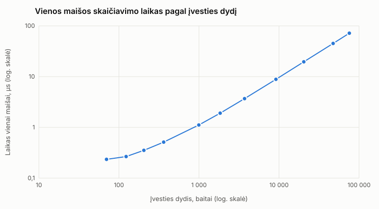

# DI maišos funkcija

256 bitų maišos funkcija, C++20. Iš bet kokių baitų – 64 hex simboliai.

> Kriptografiškai neanalizuota – netinka slaptažodžiams ir saugumui.

## 1. Paleidimas

```bash
cmake -S . -B build && cmake --build build          # numatytai Release

./build/hash-generator                  # tekstas ranka, Enter baigia
./build/hash-generator --text "hello"   # f89c7a5a…88375bf1
./build/hash-generator --file failas.txt

./build/sanity-checks                   # 62 patikros, iš jų 10 žinomų atsakymų
./tests/run_sanity.sh build             # 33 patikros
python3 tests/reference_check.py build  # 312 įvesčių lyginama su Python realizacija
python3 tests/attack_v012.py build      # V0.12 atakos: veikia V0.12, nebeveikia dabar
python3 tests/check_fixtures.py "../Joringis-no AI/data"   # bendri testiniai failai
./experiments/run_all.sh                # visi eksperimentai → results/
```

## 2. Algoritmas vienu žvilgsniu

```text
Įvestis → 32 baitų blokai → 4 × 64 bitų žodžiai
   ↓
512 bitų būsena  s0 s1 s2 s3 s4 s5 s6 s7
   ↓  žingsnis kiekvienam blokui:  t = s → įterpti → 2 raundai (pirmyn, atgal) → s ^= t
   ↓  likutis → ilgis → 3 tušti žingsniai  (tas pats žingsnis)
512 → 256 bitų sulenkimas → 64 hex
```

Schema: [docs/algoritmo-schema.png](docs/algoritmo-schema.png) (draw.io: `docs/algoritmo-schema.drawio`)

## 3. Blokas ir būsena

```text
baitai  0–7  → word0        baitai 16–23 → word2
baitai  8–15 → word1        baitai 24–31 → word3
```

* 8 × `uint64_t` = **512 bitų** būsena, pradžia – fiksuotos konstantos.
* Būsena tarp blokų **nenunulinama**; kiekvienas blokas turi pozicijos žymę.

## 4. Žodžių įterpimas

```cpp
const State before = s;   // grįžtamajam ryšiui
s[0] += word0 ^ tag;
s[2] ^= word1;
s[4] += word2;
s[6] ^= word3;
```

## 5. Du raundai ir grįžtamasis ryšys

```cpp
s[i] = (s[i] ^ std::rotl(s[i - 1], 41)) * kMulForward;   // i = 1 … 7   ┐ raundas,
s[i] = (s[i] + std::rotl(s[i + 1], 53)) * kMulBackward;  // i = 6 … 0   ┘ 2 kartus
s[i] ^= before[i];                                       // i = 0 … 7   grįžtamasis ryšys
```

```text
pirmyn:  s0 → s1 → s2 → s3 → s4 → s5 → s6 → s7
atgal:   s0 ← s1 ← s2 ← s3 ← s4 ← s5 ← s6 ← s7
```

Po vieno raundo **visos 8 dalys priklauso nuo visų 4 žodžių**; antras raundas ir grįžtamasis ryšys – V0.13 (13 sk.).

## 6. Pabaiga ir 256 bitų rezultatas

* **Likutis** (0–31 B) → nuliais užpildytas blokas, jo ilgis įmaišomas į žymę (`ab` ≠ `ab\0`).
* **Ilgis** – atskiras žingsnis; tada **3 tušti** žingsniai. Visi – tas pats žingsnis (2 raundai, grįžtamasis ryšys).

```text
out0 = s0 XOR rotl(s4, 40)      out2 = s2 XOR rotl(s6, 40)
out1 = s1 XOR rotl(s5, 40)      out3 = s3 XOR rotl(s7, 40)
```

## 7. Pseudokodas

```text
STEP(w0..w3, tag):
    t = s
    s0 += w0 XOR tag;  s2 ^= w1;  s4 += w2;  s6 ^= w3
    repeat 2 times:
        for i = 1..7:        s[i] = (s[i] XOR rotl(s[i-1], 41)) * MUL_F
        for i = 6 down to 0: s[i] = (s[i]  +  rotl(s[i+1], 53)) * MUL_B
    s = s XOR t

HASH(input):
    s = LANE_INIT;  L = ilgis;  n = L / 32;  r = L mod 32
    for i = 0..n-1:  STEP(blokas i, (i+1) * TAG_STEP)
    STEP(likutis + nuliai, (n+1) * TAG_STEP + (r+1) * TAG_TAIL)
    STEP(L, rotl(L, 32), 0, 0, TAG_END)
    for j = 1..3:    STEP(0, 0, 0, 0, TAG_END + j * TAG_STEP)
    return s[i] XOR rotl(s[i+4], 40), i = 0..3      # 32 B, didysis galas
```

## 8. Kodėl taip

* **Du perėjimai** – pokytis pasiekia visą būseną per vieną raundą.
* **Du raundai** – su vienu raundu (V0.12) dviejų blokų žodžius buvo galima išspręsti taip, kad būsena taptų bet kokia (13 sk.).
* **Grįžtamasis ryšys** (kaip Davies–Meyer konstrukcijoje) – žingsnio nebeatsuksi raundas po raundo, kaip V0.12 atakoje.
* **Nelyginė daugyba** – netiesiška ir apverčiama, informacija neprarandama.
* **Žymės** vietoj `0x80` baito – pozicija ir ilgis įmaišomi skaičiais.
* **512 → 256** – maiša neatskleidžia visos būsenos.

## 9. Įvestis

| Režimas | Kas maišoma |
|---|---|
| ranka | viena eilutė; **Enter neįtraukiamas**, tarpai ir `\r` lieka |
| `--text` | argumento baitai (UTF-8), nieko nekeičiant |
| `--file` | tikslūs failo baitai; neperskaitomas failas – klaida |

* Režimas parašomas `stderr`, maiša – `stdout`; rezultatas visada 64 mažosios hex raidės.
* `--file` skaito 64 KiB dalimis – atmintis nepriklauso nuo failo dydžio.
* Ribos: ilgis – iki 2^64 − 1 baitų (`uint64_t`); `--text` – kiek leidžia OS argumento ilgis; ranka – viena eilutė.

## 10. Eksperimentų sąlygos

| | |
|---|---|
| Aplinka | i9-10900K, Linux 6.18, g++ 15.2, `-O3`, 1 gija ([aplinka.md](results/aplinka.md)) |
| Duomenys | bendras poros rinkinys: `exp1` failai, `konstitucija.txt` (kurso medžiaga, [nuoroda](https://bit.ly/33nYy2v)) |
| Atsitiktinės įvestys | `std::mt19937_64`, seed 20260920, abėcėlė `!`..`~` (94 simboliai) |
| Atkūrimas | `./experiments/run_all.sh`, neapdoroti duomenys – `results/raw/` |

## 11. Teisingumas (1–3)

| Patikra | Rezultatas |
|---|---|
| 1 baito pakeitimai, tvarka, tarpai, LF / CRLF, `\0`, 15/16/17 B | 21/21 ✓ |
| 64 hex, mažosios raidės, pradiniai nuliai | 34/34 ✓ |
| kartotiniai kvietimai, A, B, A | ✓ |
| atskiri paleidimai / ranka = failas / `--text` = failas | 34/34, 31/31, 31/31 ✓ |

UTF-8: `utf8_lt.txt` – 15 simbolių, 26 baitai. → [exp1_3_teisingumas.md](results/exp1_3_teisingumas.md)

## 12. Sparta (4)



| Baitai | µs vienai maišai | min–max |
|---|---|---|
| 70 | 0,236 | 0,234–0,244 |
| 996 | 1,116 | 1,114–1,120 |
| 20 409 | 19,708 | 19,639–19,816 |
| 75 595 | 72,014 | 71,732–72,383 |

* Laikas auga **tiesiškai**, ≈ **1,05 GB/s**; mažoms įvestims – pastovios 5 žingsnių išlaidos.
* 3 apšilimai + 10 matavimų, be I/O; trukdžių paveikti matavimai kartojami. → [exp4_sparta.md](results/exp4_sparta.md)
* Riba – **28 nuoseklios daugybos** bloke (2 raundai × 14), todėl ≈ 2 kartus lėčiau nei su vienu raundu.

| Versija | 75 595 B, µs | Pastaba |
|---|---|---|
| V0.1–V0.11 | 35,19 | |
| V0.12 | 34,19 | GCC optimizavimas; failas skaitomas dalimis, o ne visas į atmintį |
| V0.13–V0.2 | 72,01 | 2 raundai – ≈ 2 kartus lėčiau, bet V0.12 atakos nebeveikia |

Skaičiai – `results/raw/speed.csv` atitinkamoje versijoje. Visa programa su failo skaitymu matuojama atskirai:
1 GiB per `--file` – 1,13 s, 3,7 MB atminties (`results/raw/file.csv`).

## 13. Kolizijos (5)

| Tikrinimas | Kolizijų |
|---|---|
| 4 × 100 000 porų (ilgiai 10, 100, 500, 1 000) | 0 |
| 4 × 200 000 įvesčių, visas rinkinys | 0 |
| 119 374 struktūruotos įvestys | 0 |
| tas pats, maiša sutrumpinta iki 32 bitų | 20 (tikėtina 18,6) |

* 256 bitams tikėtina ≈ 10^(−67) kolizijų – **nulis nieko neįrodo**.
* Sutrumpinta maiša rodo, kad testas kolizijas randa. → [exp5_kolizijos.md](results/exp5_kolizijos.md)

**Struktūrinė ataka prieš V0.12** – visi šie testai V0.12 irgi praėjo, bet:

| Ataka (V0.12) | Rezultatas | V0.13 |
|---|---|---|
| kolizija | du skirtingi 133 B failai, ta pati maiša | nebeveikia |
| antrasis pirmavaizdis | pakeistas `konstitucija.txt` (94 B kitokie), ta pati maiša | nebeveikia |
| pirmavaizdis | 96 B įvestis, kurios maiša – 64 nuliai | nebeveikia |

* Viename raunde operacijas galima atsukti dalis po dalies, o žodžiai laisvai nustato s0, s2, s4, s6 – todėl dviejų blokų
  žodžius galima **išspręsti** (be paieškos), kad būsena taptų bet kokia. → `tests/attack_v012.py`
* V0.13 antras raundas ir grįžtamasis ryšys šį sprendimą panaikina. Saugumo tai **neįrodo** – tik ši ataka nebeveikia.

## 14. Lavinos efektas (6)


| Ilgis | Bitai, % | Hex, % |
|---|---|---|
| 10 | 50,05 | 93,78 |
| 100 | 49,97 | 93,75 |
| 500 | 49,99 | 93,77 |
| 1 000 | 49,99 | 93,74 |
| **visi** | **50,00** (37,5–63,7) | **93,76** (76,6–100) |

* Pasiskirstymas sutampa su idealiu B(256; 0,5). → [exp6_lavina.md](results/exp6_lavina.md)
* Geras lavinos efektas **neatmeta** lengvų kolizijų: V0.12 lavinos efektas buvo toks pat, o kolizijos – akimirksniu (13 sk.).

## 15. Spėjimas ir druska (7)

| Atvejis | Maišų | Rezultatas |
|---|---|---|
| be druskos, `0000`–`9999` | 3 984 (1,79 ms) | rasta `3983` |
| viena lentelė 5 taikiniams | 10 000 | 5/5 |
| vieša druska, atskira kiekvienam | 5 × 10 000 | 5/5 |
| slaptas `r` (16 B) | 10 000 · 2^128, jei `r` nežinomas | čia `r` iš viešo seed – tik demonstracija |

* Sunkumą lemia **paieškos erdvė**, ne maišos „atsitiktinumas“.
* Druska neleidžia vienos lentelės naudoti visiems. → [exp7_spejimas.md](results/exp7_spejimas.md)

## 16. Išvados (8)

* **Veikia:** determinizmas, formatas, 0 kolizijų, ≈ 50 % lavinos efektas, ≈ 1,05 GB/s.
* **Pagerėjo (V0.13):** V0.12 kolizijos, antrieji pirmavaizdžiai ir pirmavaizdžiai, randami akimirksniu, nebeveikia.
* **Pablogėjo:** sparta ≈ 2 kartus mažesnė.
* **Neįrodo:** saugumo, atsparumo kolizijoms ar pirmavaizdžiui – V0.12 praėjo tuos pačius statistinius testus.
* **Pirmavaizdis** – mažą aibę perrenkame per ≈ 2 ms; **kolizijos** egzistuoja visada (gimtadienio paradoksas).

## 17. Apribojimai

* nepriklausomai neperžiūrėta, be saugumo garantijų; neįvertinta, kiek raundų iš tikrųjų pakanka;
* sulenkimas 512 → 256 – paprastas XOR: informacija prarandama, bet saugumo tai neįrodo;
* nėra rakto ir druskos; testai paleisti tik Linux.

## 18. DI naudojimas

* **Įrankiai:** Claude Code (Anthropic), Claude Opus modeliai (paskutiniame etape – Claude Opus 5.5); auditai – Claude Sonnet 5.5 ir ChatGPT.
* **Užklausos:** sukurti savą 256 bitų maišą, neatkartojant žinomų; pašalinti silpnybes; atlikti 1–8 eksperimentus; rasti ir pataisyti silpnybes (V0.13).
* **Atmesta:** pradinė 256 bitų būsena (maiša atskleisdavo visą būseną); xor-shift finalizatorius (per daug panašus į MurmurHash).
* **Patikrinta:** nepriklausoma Python realizacija (`tests/reference_check.py`), V0.12 atakos (`tests/attack_v012.py`), ASan / UBSan,
  62 + 33 patikros, konstantos palygintos su žinomomis.
* Išsamiau – [DI sąveikos žurnalas](docs/DI_zurnalas.md).

Peržiūrėtos SHA-2, SHA-3, BLAKE2/3, SipHash, MurmurHash3, xxHash, CityHash, FNV – jų konstantos ir funkcijos nenaudojamos.

## 19. Šaltiniai

VU BGT 1 užduotis ir kontrolinis sąrašas (2026) · [NIST Hash Functions](https://csrc.nist.gov/projects/hash-functions) ·
[BLAKE2](https://www.blake2.net/) · [SipHash](https://cr.yp.to/siphash/siphash-20120918.pdf) ·
[xxHash](https://github.com/Cyan4973/xxHash/blob/dev/doc/xxhash_spec.md) · [MurmurHash3](https://github.com/aappleby/smhasher) ·
A. Menezes, P. van Oorschot, S. Vanstone, *Handbook of Applied Cryptography*, 9.4 sk. (Davies–Meyer)

## 20. Versijos

Kiekvieno leidimo (`V0.1`–`V0.13`) `results/` – tos versijos rezultatai.

* **V0.1** – algoritmas, rankinis įvedimas, 1–8 eksperimentai.
* **V0.11** – maišos reikšmės **nepakito** (tikrina 10 žinomų atsakymų). Pataisytas CRLF testinis failas, pridėti žinomų atsakymų
  ir komandinės eilutės testai, griežtesnės lavinos patikros, duomenų kontrolinės sumos; 1–3 eksperimentų rezultatai sugeneruoti iš naujo.
* **V0.12** – maišos reikšmės **nepakito**. Failai skaitomi dalimis (`Hasher`), GCC kodas pasiekia daugybų grandinės ribą,
  CMake numatytai `Release`; pridėti srautinio maišymo ir Python palyginimo testai; sparta išmatuota iš naujo.
* **V0.13** – maišos reikšmės **pasikeitė**: 2 raundai žingsnyje ir grįžtamasis ryšys, nes V0.12 buvo randamos kolizijos ir
  pirmavaizdžiai akimirksniu (13 sk.). Nauja schema, atakų testas, visi eksperimentai pakartoti.
* **V0.2** – algoritmas ir maišos reikšmės **kaip V0.13**. Sutvarkyti kodo komentarai ir per griežti teiginiai, vardų erdvė `dihash`,
  programa su failu matuojama atskirai; visi rezultatai ir palyginimai pakartoti.
