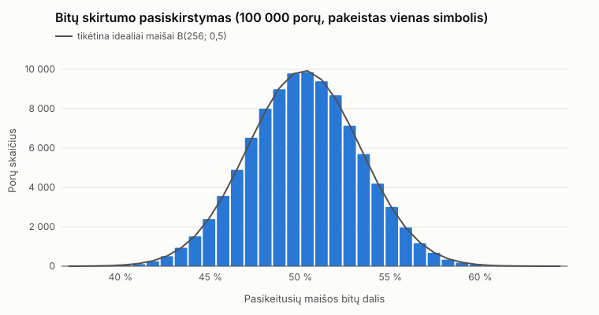

# 6 eksperimentas: lavinos efektas

100 000 porų: po 25 000 ilgiams 10, 100, 500 ir 1 000. Kiekvienoje poroje vienas atsitiktinai parinktas simbolis pakeistas kitu tos pačios abėcėlės `!`..`~` simboliu, ilgis nekinta (`std::mt19937_64`, seed = 20260920 + 100 + ilgis). Prieš lyginant bitus abi hex maišos dekoduojamos į baitus. Orientyrai: ≈ 50 % bitų ir ≈ 93,75 % hex skaitmenų.

| Ilgis | Porų | Bitai: vid. % | min % | max % | st. nuokr. % | Hex: vid. % | min % | max % |
|---|---|---|---|---|---|---|---|---|
| 10 | 25 000 | 50,05 | 37,89 | 62,11 | 3,12 | 93,78 | 79,69 | 100,00 |
| 100 | 25 000 | 49,97 | 37,50 | 62,89 | 3,09 | 93,75 | 78,12 | 100,00 |
| 500 | 25 000 | 49,99 | 38,28 | 63,67 | 3,10 | 93,77 | 78,12 | 100,00 |
| 1000 | 25 000 | 49,99 | 37,89 | 60,94 | 3,13 | 93,74 | 76,56 | 100,00 |
| visi | 100 000 | 50,00 | 37,50 | 63,67 | 3,11 | 93,76 | 76,56 | 100,00 |

Idealiam atsitiktiniam atvejiui bitų skirtumo standartinis nuokrypis √(256·0,25)/256 = 3,13 %.

## Papildomai: apverstas tiksliai vienas įvesties bitas

Tie patys ilgiai ir porų skaičius, bet apverčiamas vienas bitas (baitų režimu; seed = 20260920 + 200 + ilgis): bitų skirtumas 49,99 % (36,72–64,06 %), hex skirtumas 93,76 % (78,12–100,00 %).

Pilka linija – binominis pasiskirstymas B(256; 0,5), kurio tikėtųsi iš idealiai atsitiktinės maišos. Histogramos duomenys: `raw/avalanche.csv` (eilutės `hist`).
